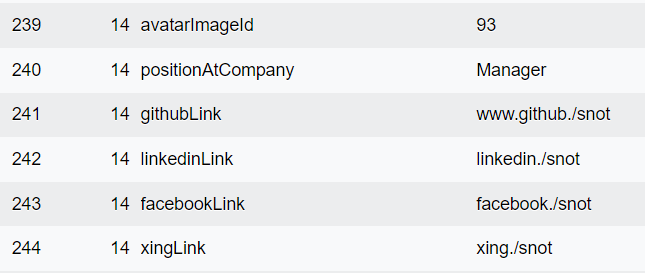
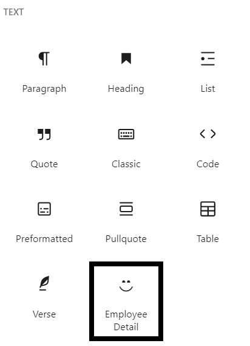
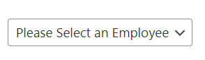
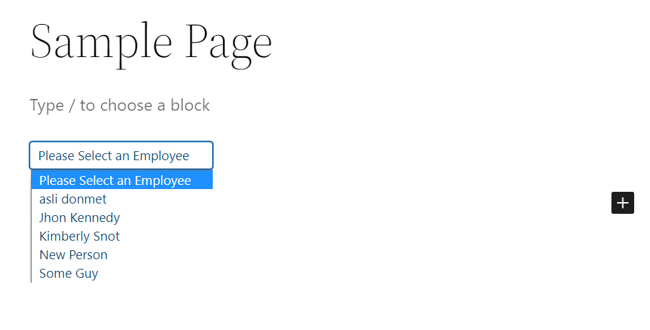
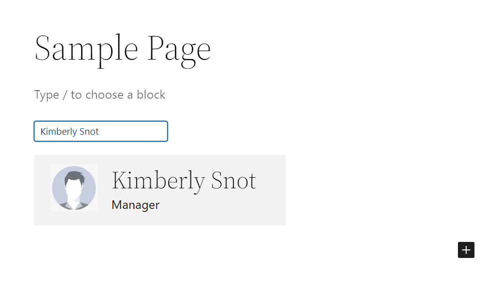
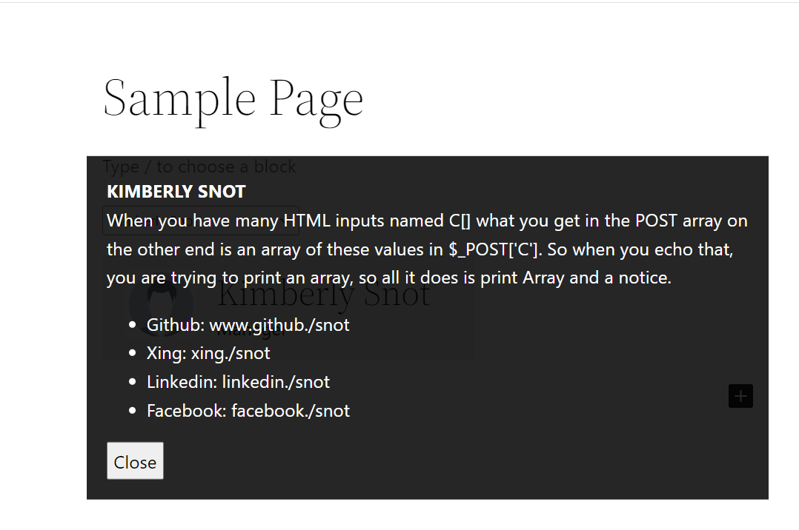

<h1> Employee Detail Block Plugin </h1>

* Developer:         Ali W.
* Tags:              block
* Tested up to:      1.0
* License:           Available to share and edit for any means needed by Inpsyde.

# A WordPress Block Pugin to get employee data from the database!

## Description

This plugin gets user/employee data from the database. It is a WordPress Gutenberg Block for the most part which can be added to the post_content as a block. The view in the editor is the same as the user frontend. The user/employee can be selected from a dropdown list, after which the user's image, full name and position at the company can be seen at first. Upon clicking the element, a small overlay appears showing more details about the user/employee which include a short description and social links.

<i>For testing purposes, 3 files are included in the `misc` folder for user registeration as more than usual data is needed to be saved at registration. </i>

## Installation

All you need to do to get the plugin working is exract the file in your plugins directory on the server and activate it from the plugins admin panel.

* Upload the plugin folder  to the `/wp-content/plugins` directory.

* Activate the plugin through the 'Plugins' screen in WordPress.

<i> If you would like to take the registration files too, you would need to place them in your root directory of WordPress and 'include' them in your functions.php file of your theme, preferably at the beginning of the file.</i>

  Write
 *  `require_once( ABSPATH . 'employeeRegistrationFrontEnd.php' );`
 *  `require_once( ABSPATH . 'employeeRegistrationBackend.php' );`
  
  And
* Place `custom_script.js`, `employeeRegistrationBackend.php`, `employeeRegistrationFrontEnd.php`  in the root directory too.

 at the beginning of the functions.php file of your theme, after moving these files in the root directory of your site (inside htdocs or public_html). And un-comment the `employeeRegistrationFrontEnd.php` file to start the custom registration. These files are located in the `/misc` folder

## Decisions taken at different stages of implimentation

* During the pre-development phase, finding a perfect boilerplate for the block was a tough job. Tried all stackOverflow/Github answers but the only one that worked was wordpress's own npm package that laid all the things out perfectly.
* The `block.json` file has all the required attributes. I decided to save most of the data in attributes due to React's asynchronous nature, so I could have all the values I need as soon as they are changed, at the `useEffect` hook.
* The `edit` function stores 3 states. The preview, employee user id and the name. The states are updated as soon as the employee selected changes from the dropdown.
* I fetch all required data from the database using the apiFetch, which has the api path defined and registered in the `employee-detail.php` file.

# Storing data in the first place

* As the assignment was more about using the stored data rather than storing it in the first place, hence a rough custom registration system was developed to cope with the testing. `jQuery` was used to speed up the process ... which is for the most part, sending ajax requests to the files stored in the root directory.
* Upon user registration, the first/last names, the description, the position and the social links can be stored in the `user_meta` table in the database and can be directly accessed. But the issue lied with using images, and I solved it by saving image upload ids during registration and connecting them to each `user_id` in the `user_meta` table.

# Database Structure

* It is to be noted that custom identifiers were used to get the required data, and the following will suggest how it was done with their corresponding identifiers:
1. `avatarImageId` to store the `post_content` image id
2. `positionAtCompany` to store the postion at the company
3. `githubLink` to store the github link
4. `linkedinLink` to store the linkedin link
5. `facebookLink` to store the facebook link
6. `xingLink` to store the xing link

* The default WordPress identifiers used are as follows:
1. `first_name` & `last_name` for the name
2. `description` for the description

The above identifiers are used to fetch required data from the database using the `get_user_meta` function.

Here is an image of the same structure:

# Further Relevant Images

